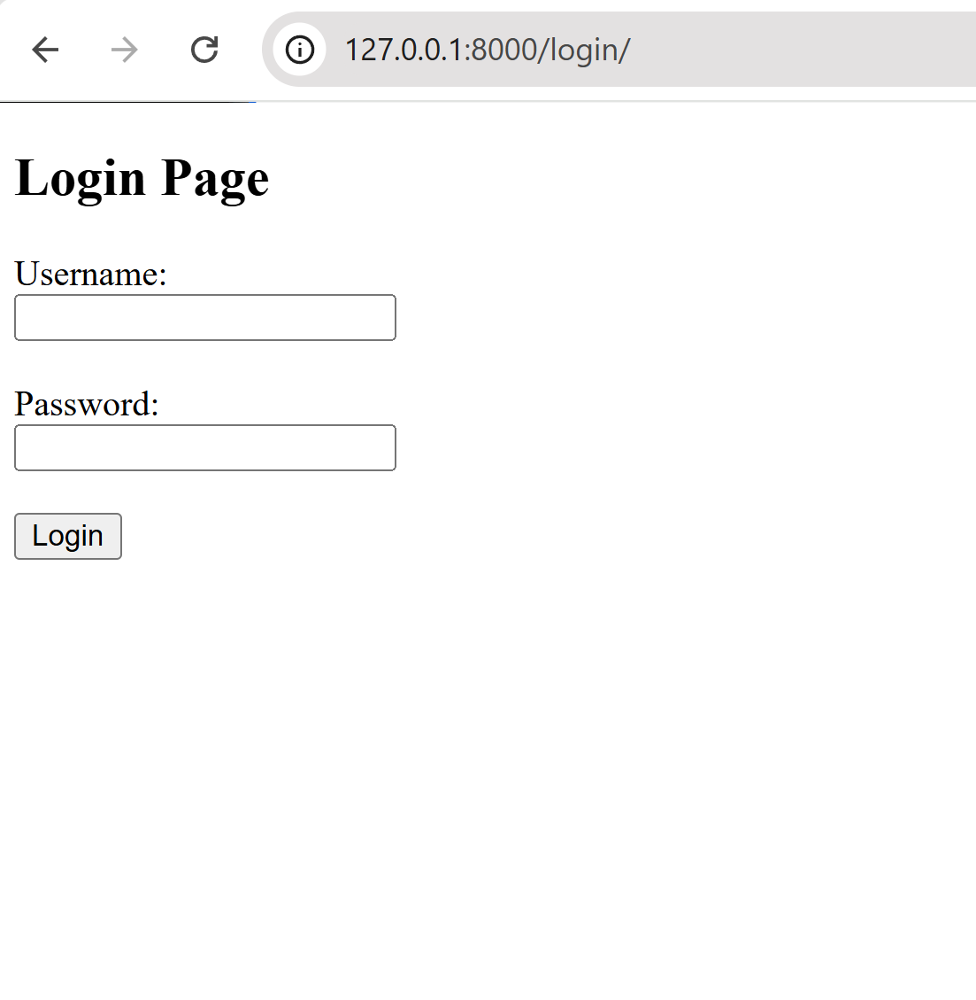
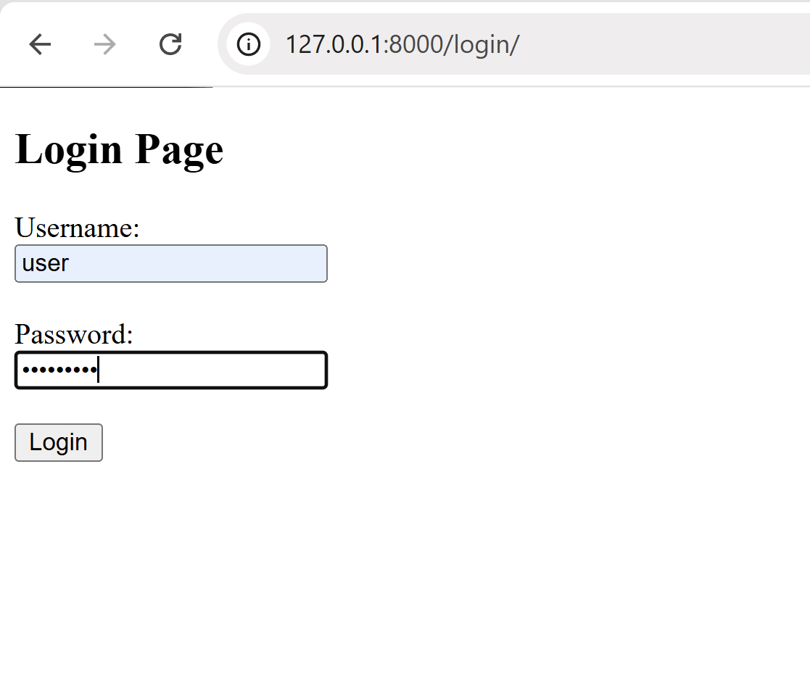
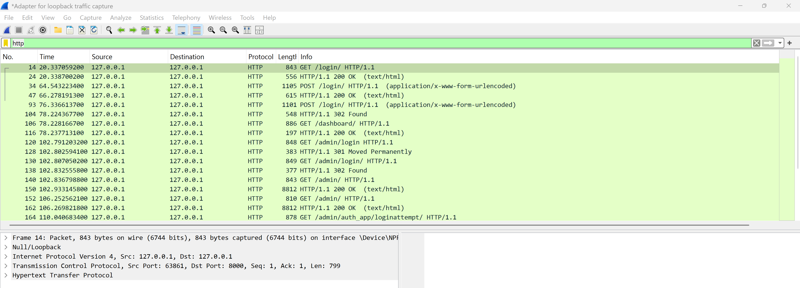
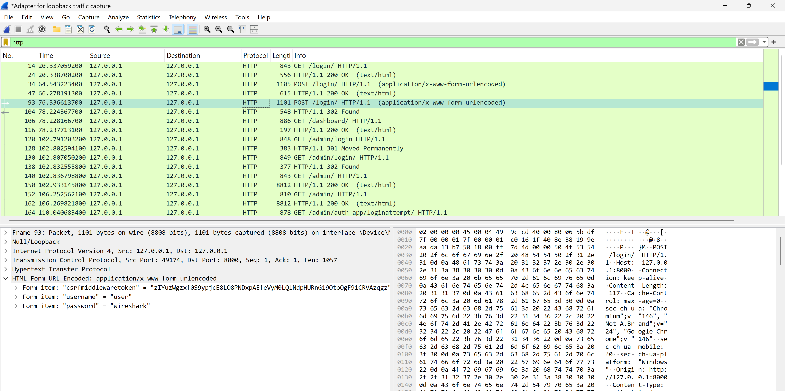
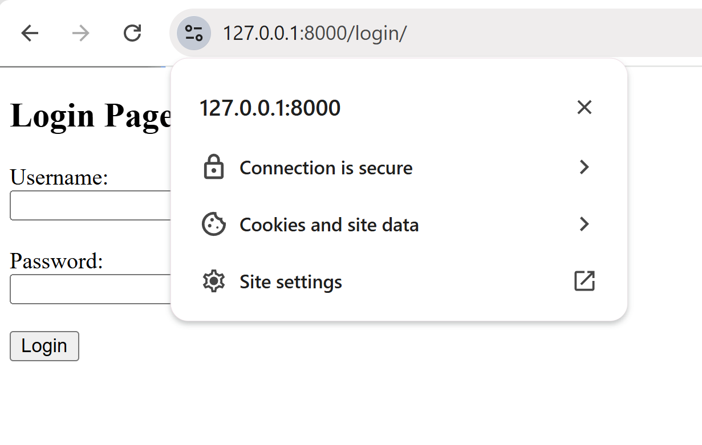
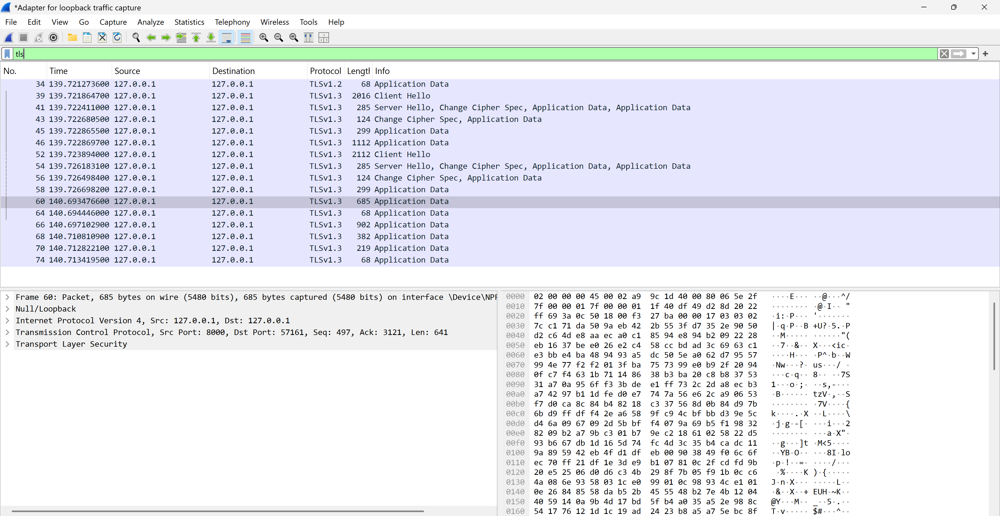
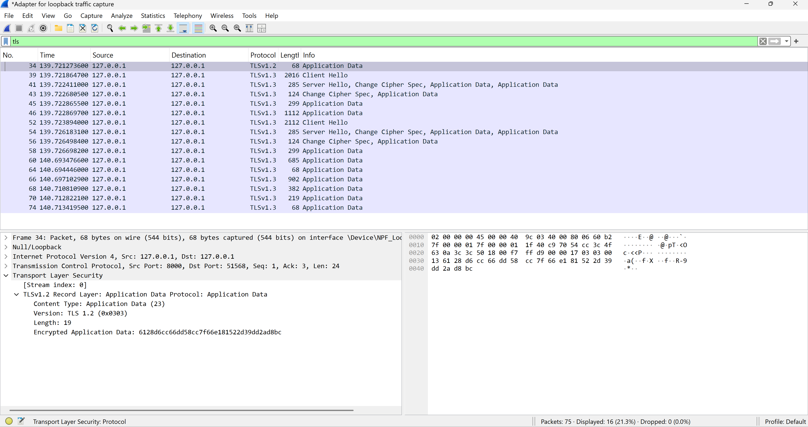

# HTTP vs HTTPS Security Analysis using Django and Wireshark

# Project Overview
This project demonstrates the security difference between HTTP and HTTPS by building a Django-based login system and analyzing network traffic with Wireshark.

The objective is to show how credentials such as usernames and passwords can be intercepted when transmitted over HTTP, and how HTTPS protects the same data through TLS encryption.

# Tools Used

- Django – Python web framework used to build the authentication system  
- Wireshark – Network protocol analyzer used to inspect traffic  
- mkcert – Tool for generating locally trusted TLS certificates  
- Python – Core programming language used for implementation  

# Methodology

The project was carried out in two main phases:

# 1. HTTP (Insecure Communication)
- A login system was built using Django  
- The application was served over HTTP  
- Login credentials were submitted through a form  
- Wireshark was used to capture network traffic  
- Credentials (username and password) were observed in plaintext  

# 2. HTTPS (Secure Communication)
- HTTPS was enabled using a locally generated TLS certificate  
- The same login process was repeated  
- Wireshark captured the traffic again  
- The transmitted data was encrypted and unreadable  

# Results and Analysis

# HTTP Traffic Analysis (Insecure)

When the application was accessed over HTTP, Wireshark was able to capture the full request details. The following observations were made:

- The HTTP POST request was visible  
- Username and password were exposed in plaintext  
- Sensitive data could be easily intercepted by an attacker  

Example of captured data:

username=user&password=wireshark

# HTTPS Traffic Analysis (Secure)

After enabling HTTPS using TLS, the same login process was repeated and analyzed in Wireshark.

The following changes were observed:

- The HTTP request details (including POST) were no longer visible  
- Credentials were not exposed  
- Traffic appeared as encrypted "Application Data"  
- Data could not be interpreted without decryption keys  

# Key Comparison

| Feature | HTTP | HTTPS |
|--------|------|------|
| Data Visibility | Plaintext | Encrypted |
| Credential Exposure | Yes | No |
| POST Request Visibility | Visible | Hidden |
| Security Level | Low | High |

# Screenshots

# HTTP (Insecure Communication)

**Login Page (HTTP)**

**Credentials Submitted**

**Wireshark Capture (HTTP Traffic)**

**Plaintext Credentials Visible**

**Login Attempts Logged**

# HTTPS (Secure Communication)

**Login Page (HTTPS)**

**Wireshark Capture (HTTPS Traffic)**

**Encrypted Traffic**

# Real-World Relevance

This project highlights why modern web applications must enforce HTTPS. Without encryption, attackers on the same network can intercept sensitive user data, leading to account compromise and data breaches.

# Limitations

- HTTPS traffic could not be decrypted in Wireshark without session keys  
- The experiment was conducted in a local environment  
- Real-world attacks may involve additional complexities  

# Conclusion

The experiment clearly demonstrates that HTTP transmits sensitive data in plaintext, making it vulnerable to interception. In contrast, HTTPS encrypts all transmitted data using TLS, ensuring confidentiality and protecting user credentials from being exposed during transmission.

# Author

Oluwaniyi Damilare Enoch  
Cybersecurity Enthusiast
